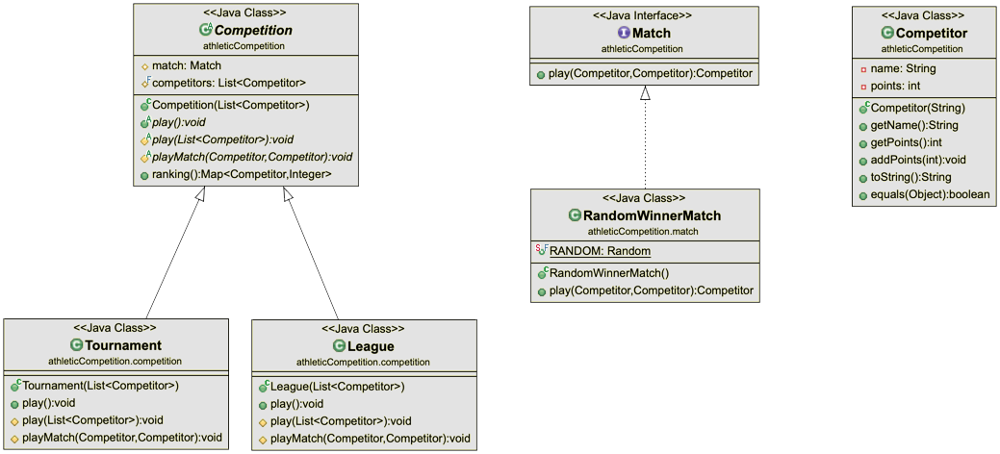
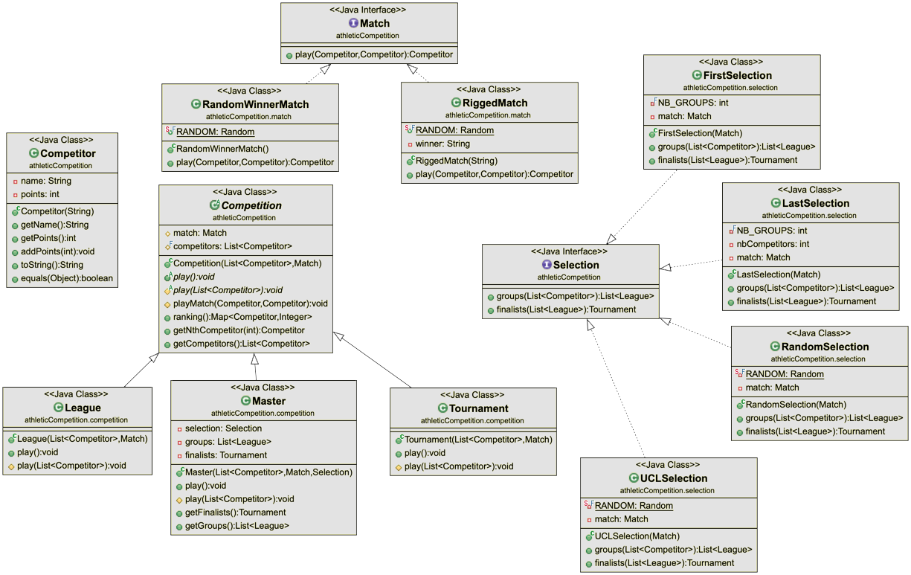
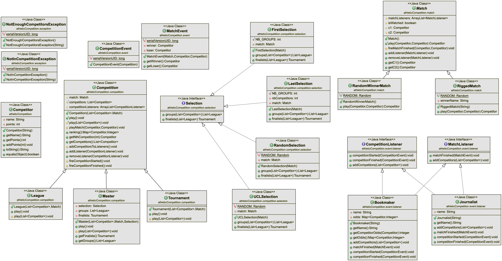

# Projet: Compétitions Sportives

***Binôme :***

    GAUDIERE Yoni
    El KHAYARI Zakaria


### Sommaire

1. [Introduction](#introduction)
1. [Livrable](#livrables)
    1. [Projet V1](#projet-v1)
    1. [Projet V2](#projet-v2)
    1. [Projet V3](#projet-v3)
1. [HowTo](#howto)
1. [Tree du projet](#tree-du-projet)
1. [Conclusion](#conclusion)

## Introduction 

Ce projet a pour but de coder une représentation de compétition sportive ou se déroulera donc des matchs qui feront jouer des
compétiteurs.Une compétition pourra prendre plusieurs formes d’organisation (ligue, tournois, et autres). Les compétiteurs
seront classés avec un système de points en fonction de leurs victoires de matchs.

## Livrables

### Projet V1




    Pour la première version du projet nous avons codé la classe Compétition qui est une classe abstraite, Tournament et Ligue qui implement cette classe abstraite,
    L'interface match qui représente tous les types de matches possibles dont RandomWinnerMatch qui choisit un vainqueur aléatoirement, la classe Competitor
    qui représente un compétiteur. Nous avons aussi codé les tests des classes instansaciables


### Projet V2





    La deuxieme version a une nouvelle Competition avec une nouvelle fonctionalité, il s'agit de la classe Master,
    cette competition consiste en diviser la liste des competiteurs en plusieurs groupes puis faire une selection de
    competiteurs de chaque poule pour les faire jouer un tournoi, La selection peut varier selon les regles atablie par
    la classe Selection, Nous avons codé plusieurs Selections, une premiere qui s'appelle FirstSelection qui prend 24 joueur,
    les divise en 4 poules de 6 puis on recupere le premier competiteur de chaque poule, Ensuite nous avons LastSelection qui
    divise N competiteurs en groupes de N/4 ce qui donne 4 groupes ensuite le dernier de chaque poule joue le tournoi (un tournoi
    de perdants). Nous avons aussi une sélection aléatoire, cette sélection divise 16 compétiteurs en groupes de 4 puis prends
    aléatoirement un  compétiteur de chaque poule et les fais jouer un tournoi. La sélection la plus complexe que nous avons 
    est UCLSelection, cette sélection réplique la ligue des champions, 32 équipes divisés en 8 groupes puis les 2 meilleurs de chaque 
    poule participe au tournoi, dans la ligue des champions nous avons 4 podiums différents pour éviter de perdre les meilleures
    équipes en phase de groupes. Notre classe UCLselection respecte cette contrante à condiiton que la liste de compétiteurs soit
    fournit dans l'orde des podiums, apres la phase de groupe, un tirage au sort est fait pour choisir les adversaire de chaque
    competiteur.   

    Une classe qui represente un match truqué a été codé aussi (RiggedMatch), cette classe prends le nom du gagnant dans le constructeur.    

    Dans cette version nous avons corrigés nos tests (de junit4 a junit5), Mais nous avons desactivé quelques methodes dans
    les tests qui nous posent probleme.  

### Projet V3




    La troisième et dernière version rajoute une fonctionnalité très utile, des événements (EventObject) et des
    observateurs (EventListener), cette fonctionnalité nous permet de rajouter des journaliste à la compétition pour
    que celle-là puisse être diffusé, des bookmakers qui feront évoluer les cotes de compétiteurs et d'autres
    observateurs qu'on pourrait rajouter (Commentateur, Arbitre, etc).
    Pour cette version, nous allons nous limiter aux bookmakers et aux journalistes. Plusieurs classes ont été rajouté
    et quelques classes ont été modifiés pour les adapter aux consignes du livrable 3. Nous avons rajouté les classes
    CompetitionEvent et MatchEvent qui représente les événements des compétitions et des matches, ces classes
    héritent de la classe EventObject. Les interfaces CompetitionListener et MatchListener qui représentent les
    observateurs, ces deux interfaces héritent de la classe EventListener. Et finalement les classes Journalist et
    Bookmaker qui implémentent toutes les deux des interfaces CompetitionListener et MatchListener.

    > Remarque : une competiiton sera pas diffusé si elle ne possède pas de Journalist,
    > le ranking et le gagnant seront affichés mais les résultasts des matchs resterons inconnus.
    
    La première classe modifié est la classe Competition qui maintenant possède d'un attribut CompetitionListeners
    pour stocker tous les observateurs, d'une méthode addCompetitorsToListeners() pour rajouter la liste des
    compétiteurs aux observateurs, seulement Bookmaker a besoin de la liste des competitors mais nous donnons
    l'option de la rajouter à tous les observateurs parce qu'il pourrait avoir d'autres observateurs comme par
    exemple un arbitre qui a besoin de la liste des compétiteurs pour garder une trace de leur pairplay (fautes,
    malus, etc). Nous avons aussi les méthodes addListener(CompetitionListener cl)
    et removeListener(CompetitionListener cl) qui servent à rajouter ou à supprimer un observateur de l'attribut
    CompetitionListeners. Et pour terminer nous avons les méthodes qui permettent de faire réagir tous les
    observateurs au début et à la fin de la compétition, fireCompetitionStarted() et fireCompetitionFinished().
    
    L'interface Match e été modifié aussi, maintenant, c'est une classe abstraite, nous avons choisi de representer un
    match en classe abstraite pour avoir l'attribut matchListeners qui stock tous les observateurs du match, la
    méthode play(Competitor c1, Competitor c2) reste en abstraite, les méthodes addListener(MatchListener ml) et
    removeListener(MatchListener ml) qui servent à rajouter ou supprimer un observateur de l'attribut
    matchListeners, et comme pour la classe Competition, la methode qui nous permet de faire réagir tous les
    observateurs à la fin de chaque match, fireMatchFinished(Competitor winner, Competitor loser). Le
    fonctionnement de la classe match ne change pas, on continue à avoir une seule instance de Match qui sera
    créé  au début de chaque compétition.
    Les classes Bookmaker et Journalist ne font que réagir aux fireMatchFinished(), fireCompetitionStarted() et fireCompetitionFinished(). 

    Nous avons également crée des nouveaux tests pour les nouvelles classes rajoutées et corrigé les tests que nous avons desactivé pour le livrable 2.


## Howto

On commence par cloner le depot : 

```console
$ git clone  <adresse du depôt>
```


Pour créer tous les fichier .class : `make cls`, pour les effacer `make clean`.

-   Pour lancer une Ligue:

    ```console
    $ make LeagueMain
    ```

-   Pour lancer un Tournoi :

    ```console
    $ make TournamentMain
    ```

-   Pour lancer un Master :

    ```console
    $ make MasterMain
    ```

-   Pour lancer une ligue des champions :

    ```console
    $ make ChampionsLeague
    ```

-   Pour lancer une ligue des champions truquée (FC Barcelone gagne toujours):

    ```console
    $ make ChampionsLeagueRigged
    ```

**_Les tests :_**

-   Pour compiler les tests : 
    
    ```console
    $ make tests
    ```

-   Pour executer les tests:

    ```console
    $ make run_tests
    ```

**_Les .jar :_**

-   Pour créer les .jar : 
    
    ```console
    $ make jar
    ```

-   Pour un executer un .jar (exemple avec League.jar):

    ```console
    $ java -jar jar/League.jar zac yoni messi ronaldo 
    ```
    ou sans parametres (avec comptetiteurs par defaut):

    ```console
    $ java -jar jar/League.jar
    ```
    
**_Documentaion :_**

-   Pour generer la docuemntation :

    ```console
    $ make doc
    ``` 

    Puis ouvrir `docs/doc/index.html`:

    -   Linux :

    ```console
        $ xdg-open docs/doc/index.html
    ```

    -   MacOs :

    ```console
        $ open docs/doc/index.html
    ```

    -   Windows (cmd) :

    ```console
        $ docs/doc/index.html
    ```

## Organisation du projet

```console
.
├── Makefile
├── README.md
├── classes
├── docs
│   ├── doc
│   ├── manifest
│   └── uml
├── jar
├── src
│   └── athleticCompetition
│       ├── competition
│       │   └── selection
│       ├── event
│       │   └── listener
│       ├── exception
│       ├── main
│       ├── match
│       └── util
└── tests
```

